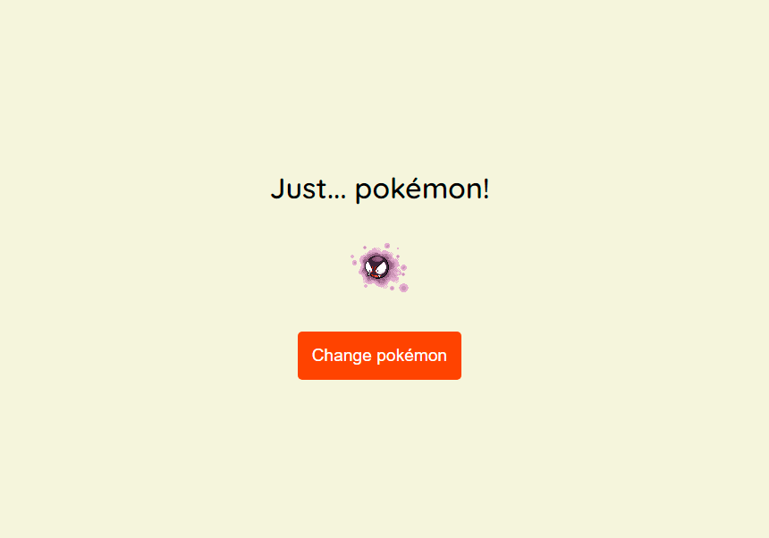

# Javascript Assíncrono

Este repositório contém a atividade prática do Curso "Javascript Assíncrono", que faz parte do Basecamp de Javascript minstrado pela [Digital Innovation One](https://digitalinnovation.one/).

## API "pokeAPI"

Nesta atividade, criamos uma página que carrega sprites aleatórias de pokémons sempre que clicamos no botão.

1. Utilizamos a API `https://pokeapi.co/api/v2/` para fazer as chamadas com o método `fetch()`.

## Demo

